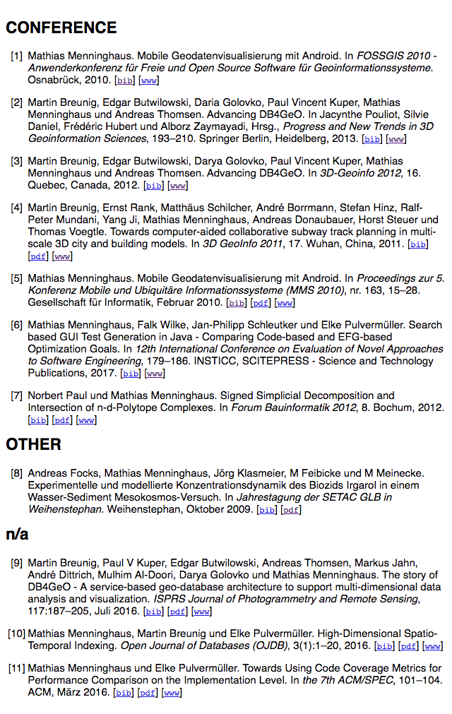

Before you start
================

In the current setup, we have BibTeX files for each group member. They should
first be assembled into one BibTex file by use of ``bibtool`` (this program must
be installed separately). This can be done
like this::

    bibtool -Aa -d -f short -s -i *.bib -o all/all.bib
            ^    ^  ^        ^  ^
            |    |  |        |  |
            |-alphanumeric disambiguation 
                 |  |        |  |
                 |  |-generate new short keys
                 |           |  |
                 |-comment out duplicate entries
                             |  |
                             |  |-input files
                             |
                             |-sort ascending

The resulting BibTeX file can then be fed to Publipy. The cleaned-up
publications on which to run the above command can be found at
`Github <https://github.com/themightyoarfish/uos-swe-publications>`_.

Command Line Interface
======================

Publipy currently has three subcommands to ``build``, ``list``, and ``add``
bibliography data.

Building a database
-------------------

Before anything else, bibliography data must be imported into publipy via
``publipy build``. The options are such:

.. option:: -d <DATABASE>, --database <DATABASE>

    Path to ``.bib`` file with all entries

.. option:: -p <PDF_LOC>, --pdfs <PDF_LOC>
    
    Path to pdf folder.

This will rekey all entries (since collisions from the Bibtool pass may have led
to similar keys) and read all pdf files from the pdf directory. The files inside
should be named with the key of their associated publication.
The command will create the following directories under the one in which the
database file is located

* ``bib`` - Contains singular BibTeX files for each entry
* ``abstract`` - Contains abstracts of all publications which possess this field
* ``pdf`` For each pdf file whose name is a key in the database, a new file will be placed here

In every case, a file's its name will reflect the new key which its BibTeX entry was given.

``build`` ing a database will add the fields ``publipy_biburl``,
``publipy_pdfurl``, and ``publipy_abstracturl`` and assign the paths to the
files created in the above directories, so that in the html output, proper links
can be generated.

Exporting a database
--------------------

Publipy can export to different formats:

* HTML - Items are wrapped in ``<dd>`` tags
* TeX - A LaTeX document is generated which when compiled contains the
  bibliography data
* BibTeX

The ``list`` subcommand understands these options
 
.. option:: -f {bib,html,tex,pdf}, --format {bib,html,tex}
    
    Format to output.

.. option::  -o OUT, --out OUT    

    File to write to. The appropriate extension is automatically appended, if
    not given in the name.

.. option::  -e EXPR, --expr EXPR 
    
    Filter with python expression. A variable ``entry`` denotes the entry to
    consider. This is currently insecure, since it calls ``eval()`` on the
    input.

.. option::  -p PERSON, --person PERSON

    Print only publications this person is involved in (be
    it author or editor). Currently, there is no fuzzy matching, so the name
    (including middle names) must be exact.

.. option::  -m MYTYPE, --mytype MYTYPE

    Print only publications that have this ``mytype`` value.

.. option::  -c, --complete_html  

    Whether or not to produce valid HTML or only the ``<dl>`` element to place
    inside another document. Ignored in any format except html

.. option::  -g GROUPBY, --groupby GROUPBY

    Group resulting publications into sections. The argument is the field to
    group on.  Items which don't have this field are lumped together into an
    ``n/a`` category.

.. option::  -b BIBFILE, --bibfile BIBFILE

    Name of the file to reference in the tex file. Must be
    generated separately (e.g. by use of ``publipy list``).

.. option::  -t TEMPLATE, --template TEMPLATE

    Name of the jinja2 LaTeX template. You can use a custom one if desired.
    Igored unless TeX output is chosen.

.. option::  -s key, --sort key

    BibTeX attribute to sort by (optional, defaults to ``year``)

Examples
--------

Assuming the database was built first by this command::

    ./publi.py build -d <path-to>/all.bib

the following sections show the most common usage.

HTML
^^^^^^^^

The most common usage might be to export in HTML format all entries,
grouped by the ``mytype`` and sorted by year. This can be done like this::

    ./publipy list -f html -c -g mytype -o all -s year

A common usage might be to export all entries of a given author. For this, just
pass the ``--person`` option additionally.::

    ./publipy list -f html -p "Mathias Menninghaus" -c -g mytype -o menning -s year

The result output as ``menning.html`` will look like this:

LaTeX/PDF
^^^^^^^^^^

Creating a PDF document is marginally more involved. Specifying ``tex`` output
format will yield a ``.tex`` file which can be compiled provided a BibTeX file
named named like the ``bibfile`` argument is present during compilation. This
file can be generated by publipy. You may compile the file yourself (compile,
run bibtex twice, compile twice more) or use the ``compile.sh`` script shipping
with the software which will perform these steps on all ``*.tex`` files in its
directory (it will swallow any errors, however).

The workflow would be thus::

    ./publipy list -f bib -o all
    ./publi.py list -f tex -o all -c -g mytype -s year -b all

    mv all.bib all.tex tex/
    cd tex/
    ./compile.sh

The TeX file will reference ``all.bib``, so you need to pass the `-b` flag to
the ``list`` subcommand when generating the TeX file for another BibTeX file.

This will create ``all.pdf``. You can also compile this manually as you would
any other TeX document.

You can pass a custom template with the ``-t/--template``
argument. The jinja2 engine is configured to use ``((* ... *))`` as delimiters
and makes available the following identifiers:

* ``grouped``, `boolean`, ``True`` if `-g` was passed during generation, so the
  output is grouped into sections
* ``groups``, `dictionary` with ``name: group`` pairs.
    - Each group is a `dict` and provides ``key: item`` pairs.
* ``bibfile``, `string`, name of the BibTeX file to reference.

Scurtinize the provided example or the publipy source code for creating your own
templates.

BibTex
^^^^^^^

Generating BibTeX is trivial, using ``bib`` as a format argument will simply
output a BibTeX file.
